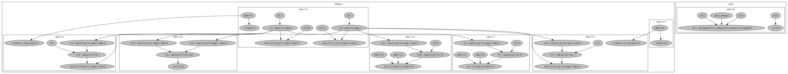
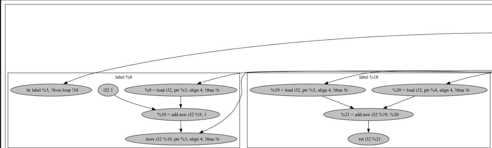
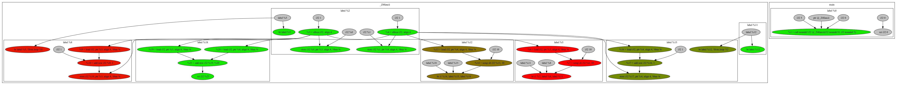
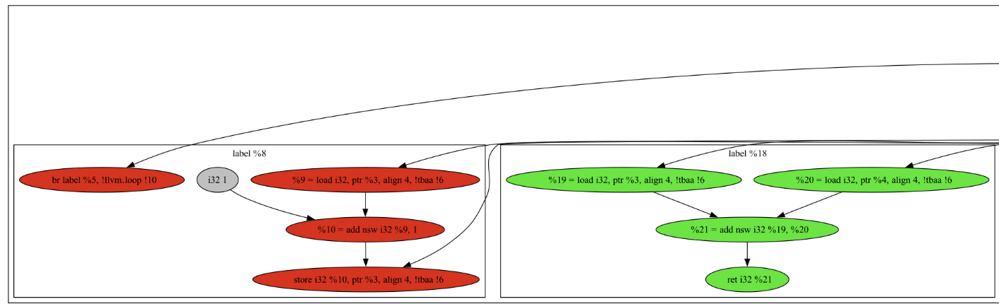
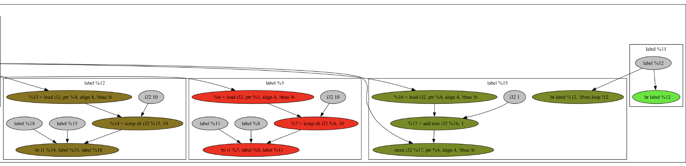
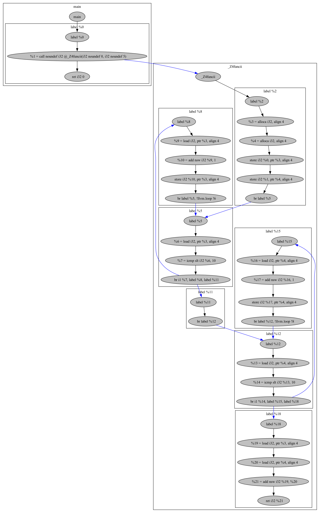
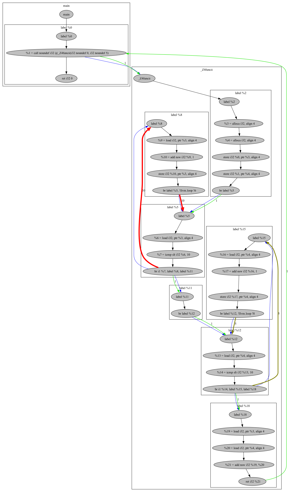
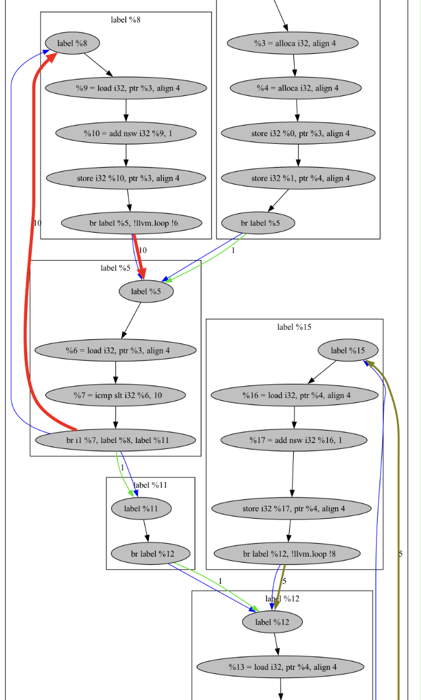
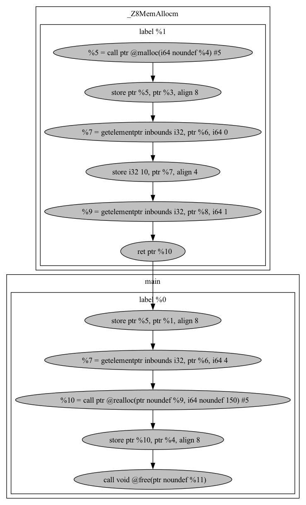

# LLVM PASS

## Description

This project contains 3 LLVM Passes that are used for debugging and potentially optimization purposes: 

- [Def use graph builder](#def-use-pass)
- [Control flow graph builder](#control-flow-pass)
- [Memory allocation / use graph builder](#memory-alloc-use-pass)

Using LLVM Pass, static graphs that represent dependencies between instructions are built during compile-time. Furthermore, code is instrumented with logging functions that provide dynamic information in runtime. For example, the def/use graph can be built using only static information. And dynamic logging helps to answer various questions such as:
1. How often particular branch is taken?
2. How often is this instruction executed? 
And many other questions that couldn't be answered at compile-time.

If program consists of different translation units, graphs generated from different units are split. It is useful, because this way graph representations are not too cluttered.

## Install and Run

```
git clone https://github.com/d3clane/llvm_pass.git
mkdir build && cd build
RUN_SOURCES="../c_examples/fact.c" cmake ..
make
```

These commands generate the executable `a.out` that you can now run. In environmental variable "RUN_SOURCES" could be set any sources to compile with pass. After running it, dynamic information is collected and stored into files with names `n_passes_edges` for control flow graph and `node_usage_count` for def_use graph. In order to combine static graphs with dynamic info you should run:

```
./ConcatDU node_usage_count def_use out_file_name
./ConcatCF n_passes_edges control_flow out_file_name
./ConcatMF memory_usage memory_flow out_file_name
```

If you'd like to see only static information, concatenate it with empty_file:

```
./ConcatDU empty_file def_use out_file_name
./ConcatCF empty_file control_flow out_file_name
./ConcatMF empty_file memory_flow out_file_name
```

Pngs will be generated and stored in build/png/.

Further in Readme trivial examples are used to show how it all works. However, all this could  be run on more complex ones, but it is useless to insert this into readme because of overwhelming amount of nodes presented in these graphs. Using instructions from this section anyone could run it on desired code.

## Def Use Pass

The def-use representation is a format in which nodes are functions, basic blocks, instructions or constants and edge from node1 to node2 is held if node2 uses node1 as an operand. Examples have been compiled without optimization, otherwise it would change significantly. Here's a simple one: 
```C
int func(int val1, int val2) {
   while (val1 < 10) {
    ++val1;
   }

   while (val2 < 10) {
    ++val2;
   }

   return val1 + val2;
}

int main() {
    func(0, 5);
}
```

Results in this graph:



It's quite hard to see, so here's part of this graph:



Now, we can add runtime information to this graph. For now, it is instrumented with `CountUsage` function that for each node in def/use graph count how many times this instruction is executed during program. After that using script nodes are colored in something between green and red based on instruction utilization (more "red" means more executions). Here's the result:



And here's some parts of this graph:

  


We can see that some of the nodes are red - meaning that they are executed most frequently. There are also green ones - meaning they are executed rarely. And there are even in-between colored (something between green and red) nodes that indicate that they are executed not the most frequent, but also not rare.

Now, for better understanding of flow of data and control, let's see how control flow pass works.

## Control Flow Pass

In control flow graph nodes are still functions, basic blocks and instructions. An edge from node1 to node2 exists at compile time if after executing node1 the next executing instruction could be node2. For instance, edge from `call` to `called function` is drawn. Or, two edges from a `branch to label1 or label2` are created to `label1` and `label2`. Here is the representation graph for the same program:



Blue edges mean "non-linear" change of control-flow (branches, calls, etc.).

Now, moving on to dynamic information. It's impossible to say at compile-time, how many times will specific branch be taken, which branch is taken more often, or, for example, how many times function is called from this `call` instruction. The more frequent is particular jump, the thicker and "more red" becomes the edge. There are also numbers written on edges that indicate frequency of jump. Here's the result: 



And one of the components of this graph:



And this image perfectly matches the previous def/use graph. These two representations are very convenient when using together.

## Memory Alloc Use Pass

In this representation all edges are created only at runtime. Code is instrumented with tracking functions that track flow of memory - it's allocation, reallocation, deallocation and usage. Currently, it works only with C API - malloc, calloc, realloc, free.

Here's the example:
```C
#include <cstdlib>
#include <cstdio>

void* MemAlloc(size_t size) {
    void* mem = malloc(size);

    ((int*)mem)[0] = 10;
    ((int*)mem)[1] = 20;

    return mem;
}

int main() {
    void* mem = MemAlloc(100);

    ((int*)mem)[4] = 40;

    int value = 5;
    int* fake_pointer = &value;

    *fake_pointer = 10;

    void* new_mem = realloc(mem, 150);
    
    free(new_mem);
}
```

And the result:



As we can see, all accesses to memory on heap are tracked and accesses to pointers to stack are not presented on graph because they don't interact with heap memory.

Memory allocations graph is very useful. It could be used to
1. Detect memory leaks - by instrumenting quit of the 'main' function with checking whether all tracked memory were freed.
2. Detect use-after-free. For instance, now I instrument every usage of pointers, every free. Therefore, if free on particular memory occurred and no allocation of this memory address happened between free and usage - it indicates heap use after free. 
3. Detect double-free, free of not allocated memory.

Unfortunately, at the moment these features are not supported.
